***Con la colaboración de la [Fundación Española para la Ciencia y la Tecnología](https://www.fecyt.es/) - [Ministerio de Ciencia e Innovación](https://www.ciencia.gob.es/)***

Cada año se estima que 25 millones de meteoroides, micrometeroides y otras partículas entran en nuestra atmósfera cada día, es decir, más de 15.000 toneladas de material que llega a la Tierra cada año.
Esas pequeñas partículas están en nuestro entorno cotidiano y son fáciles de descubrir. ¿Quieres saber cómo? Te animamos a que hagas este fácil experimento.

**Kit básico para la expedición:**

-	•	Un imán
-	•	Un plástico fino o film transparente para envolver el imán
-	•	Una cuerda 
-	•	Una lupa o microscopio
-	•	Alcohol etílico
-	•	Una aguja o un palillo
-	•	Una cámara para enviarnos una foto del hallazgo

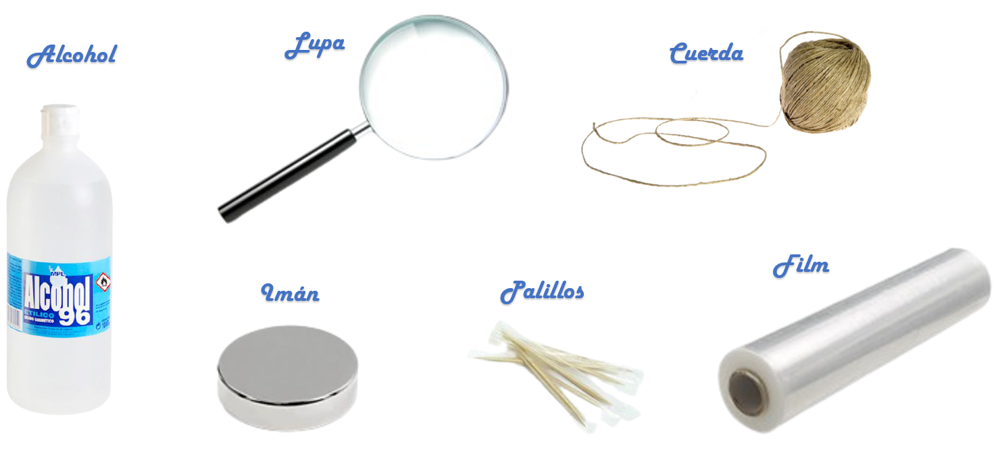

**Pasos a seguir:**

1. Envolvemos el imán con el film transparente y lo atamos a la cuerda para que sea más cómodo el experimento.
 
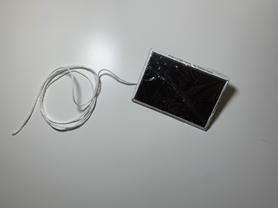

2. Salimos al exterior y, con la ayuda de la cuerda, vamos pasando el imán por distintas zonas para que el imán capte las partículas metálicas. 

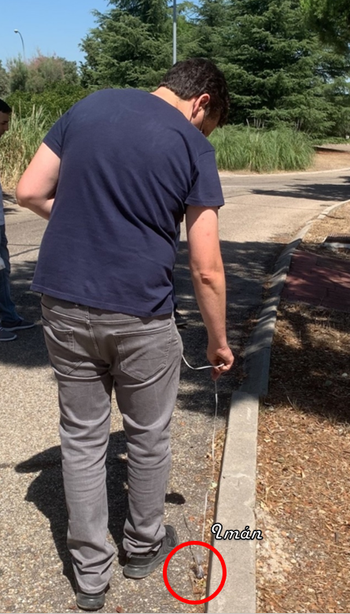

3. En cuanto veamos que se ha adherido suficiente sustancia al nuestro imán, podemos proceder a la limpieza de estas sustancias y buscar micrometeoritos!
 
 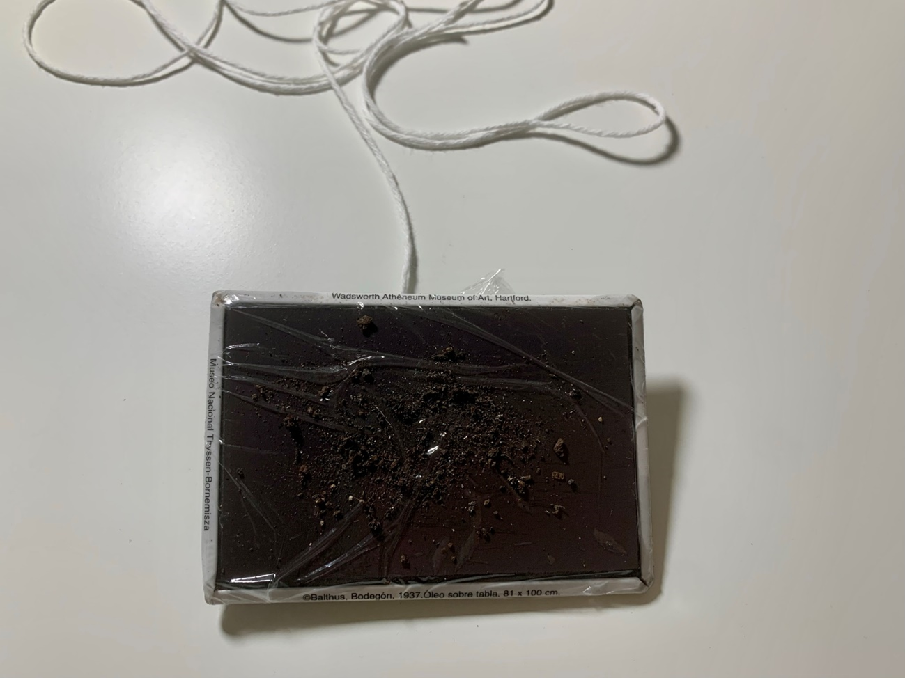

4. En un pequeño contenedor, echamos un poco de alcohol y sumergimos el imán con el film en dicho contenedor. 
Retiramos la cuerda y el imán dejando solamente el film surgiendo en alcohol. El alcohol ayudará a disolver las sustancias orgánicas y así poder encontrar más fácilmente los micrometeoritos.
Al cabo de unos segundos podemos retirar el film y ya habríamos extraído todas las sustancias en nuestro contenedor.
 
 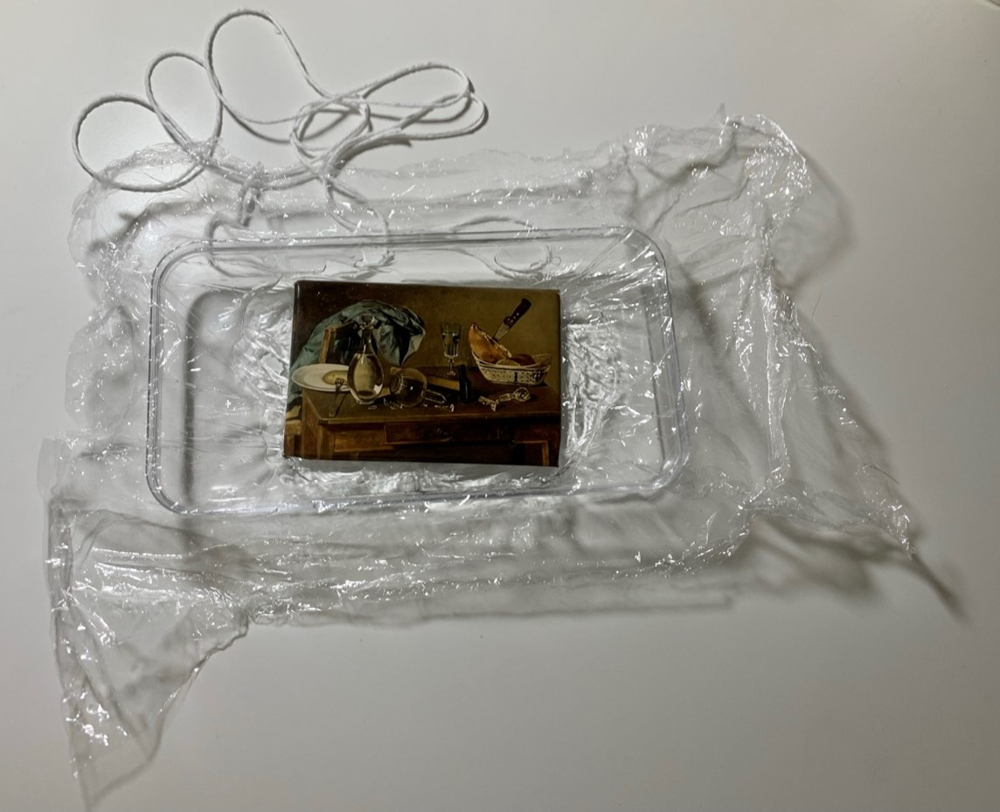

5. Una vez que tengamos todas las sustancias en el alcohol, vamos a separar las partículas e intentar buscar los micrometeoritos con la ayuda del palillo y de la lupa.
Ten en cuenta que los micrometeoritos tienen una forma esférica, por lo que intentaríamos buscar partículas esféricas entre toda la sustancia captada por el imán.

A continuación te proporcionamos algunos ejemplos de nuestras exploraciones para que veáis lo pequeño que son y la forma esférica que tienen:

**Experimento 1:**
 
 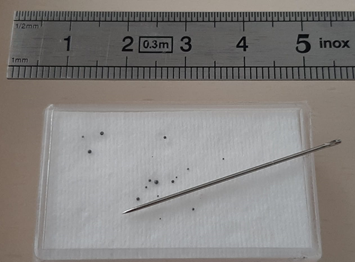

 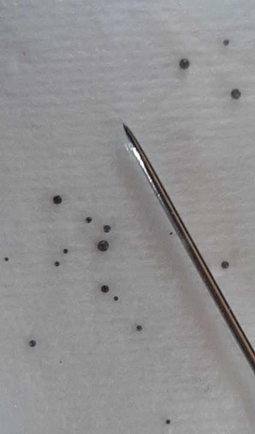
 
**Experimento 2:**
 
 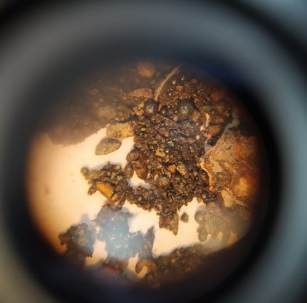

¿Quieres obtener tu propio regalo proveniente del sistema solar? Realize este experimento y comparte tu micrometeorito en Instagram, Twitter o TikTok con el hashtag **#yoCazoMeteoritos** y menciónanos:

Twitter: *@cslabupm*

Instagram: *@cslabupm*

Facebook: *@cslab-upm* 

Por ejemplo:

Este verano #yoCazoMeteoritos en Alpedrete con mis amigos. Iniciativa *@cslabupm*

Nos gustará saber qué tal os lo habéis pasado :) Buen verano.

#### Y si quieres saber un poquito más de qué va esto … sigue leyendo.

Estándares de aprendizaje:

1. Diferencia entre cometa, asteroide y meteoroide
2. Diferencia entre meteoroide, meteoro y meteorito
3. Identifica formas de ver meteoros desde la Tierra

**Introducción**

Un asteroide es un cuerpo celeste rocoso, más pequeño que un planeta y mayor que un meteoroide. La mayoría orbitan en el cinturón de asteroides.
Un meteoroide es un objeto con un diámetro menor de 50 metros con órbita en la vecindad de la Tierra. La mayoría de los meteoroides son fragmentos de cometas y asteroides. Estos cuerpos pueden entrar en nuestra atmósfera. Entonces el meteoroide se calienta y se vaporiza parcial o completamente. Nosotros vemos un brillo que denominamos estrella fugaz o meteoro.
Más allá de Plutón: Los cometas. Son visitantes de nuestro sistema Solar. No los vemos todos los años, pero dejan su material por el caminito que hacen pues se van deshaciendo cuanto más próximo al Sol están. Los cometas están hechos de hielo y rocas.
En su órbita, el cometa pasa la mayor parte del tiempo muy lejos del sol, pero cuando se acerca a éste, el hielo se sublima, es decir, el hielo pasa de estado sólido a estado gaseoso sin tener un paso intermedio por el estado líquido. Ese gas que escapa del núcleo sólido del cometa, arrastra partículas de polvo y forma una nube a su alrededor que es lo que llamamos cabellera o coma.
Los materiales de la cabellera son arrastrados en sentido opuesto al sol por el viento solar y eso da lugar a la cola del cometa.
La Tierra gira alrededor del Sol y a veces, atraviesa esos restos que dejó el cometa. Cuando esto ocurre vemos un montón de estrellas fugaces. 

**¿Qué es un meteorito?**

Es un concepto que se reserva para distinguir el fenómeno luminoso que se produce cuando un meteoroide atraviesa nuestra atmósfera. Es sinónimo de estrella fugaz, término impropio, ya que no se trata de estrellas.

**¿Por qué vemos estrellas fugaces?** 
Gracias a nuestra atmósfera. Los meteoroides se calientan al llegar a nuestra atmósfera y se vaporiza parcial o completamente. Entonces nosotros vemos un brillo que es lo que denominamos estrella fugaz o meteoro.
Pero veamos que ocurre en la Luna, donde no hay atmósfera
Experimento: Caja llena de harina y encima una capa de cacao: tiramos canicas o piedras de diferente peso y con diferentes ángulos y vemos cómo se forman los cráteres.

 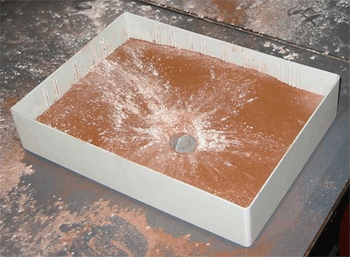
 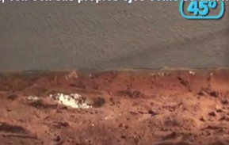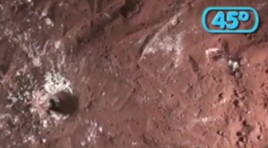
 
 
Los cráteres de impacto se forman cuando un meteorito se estrella contra la superficie de la luna o de un planeta (o de otro cuerpo en el espacio). Podemos apreciar cómo debido al impacto, el material más profundo de la superficie queda dispersado a nuestra vista. Observando los segmentos de harina esparcidos por la superficie podemos adivinar el ángulo de impacto del meteorito. Observando el cráter formado también podemos estimar el tamaño del meteorito.
Los científicos usan herramientas para buscar y observar cráteres y aprender más sobre los procesos geológicos en los planetas, las lunas, los asteroides, y otros mundos.
Nuestra atmósfera es como un escudo para estos objetos que chocan contra ella y por eso lo que vemos es un destello.

**¿De dónde vienen los meteoros?**
Los meteoros se producen cuando el meteoroide choca contra nuestra atmósfera. Es entonces cuando podemos ver estrellas fugaces si es de noche. Cuando el meteoroide choca contra la atmósfera, se denomina meteoro y cuando el material del meteoroide llega hasta nuestra superficie se llama meteorito.

