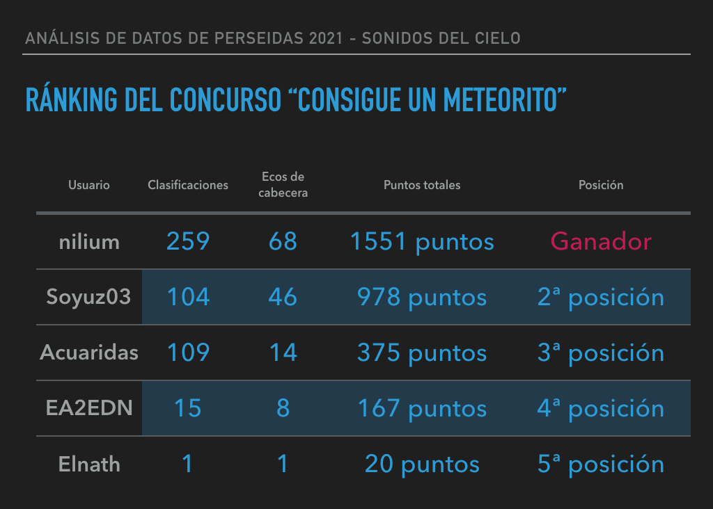

***Con la colaboración de la [Fundación Española para la Ciencia y la Tecnología](https://www.fecyt.es/) - [Ministerio de Ciencia e Innovación](https://www.ciencia.gob.es/)***

Entre los días **29 de agosto** y **2 de septiembre** hemos lanzado el concurso "Consigue un meteorito" que trata de clasificar los meteoros que hemos capturado durante Perseidas a través de la plataforma Zooniverse ([https://www.zooniverse.org/](https://www.zooniverse.org/)). 

En los cinco días que duró el concurso, hemos recibido un total de **531 clasificaciones** y todos los ecos han sido clasificados al menos por un usuario. Si no pudiste participar en el concurso y estás curioso en lo que hacemos, te recordamos que nuestro experimento sigue disponible en [https://www.zooniverse.org/projects/cslab-upm/sky-sounds](https://www.zooniverse.org/projects/cslab-upm/sky-sounds).

Y a continuación, ¡os publicamos los resultados del concurso!

Enhorabuena a ***@nilium*** por ser el ganador del concurso. 

¡Muchísimas gracias a todos que han participado en el concurso! 

¡Hasta la próxima!

***Con la colaboración de la [Fundación Española para la Ciencia y la Tecnología](https://www.fecyt.es/) - [Ministerio de Ciencia e Innovación](https://www.ciencia.gob.es/)***

