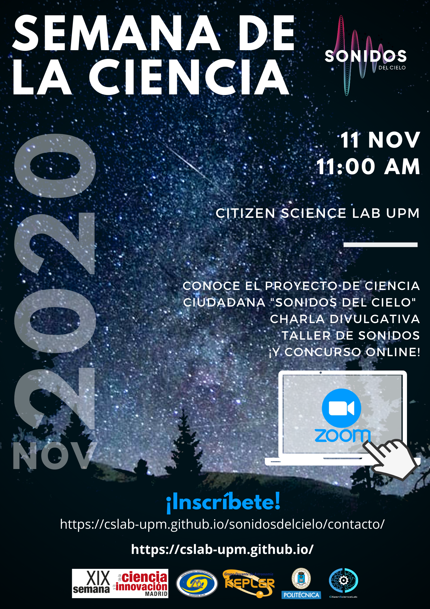

El próximo día **11 de Noviembre a las 11:00** participaremos en la Semana de la Ciencia con una charla divulgativa en la que hablaremos sobre el proyecto *Sonidos del Cielo*. En esta charla contaremos con la colaboración de Ángel Pérez Navarro, miembro de la Agrupación Astronómica Madrid Sur y Grupo Kepler, que hablará sobre el contexto del proyecto y cómo se producen los sonidos que se utilizan para la clasificación de meteoros. 

Tras esta introducción, realizaremos un taller de sonidos en el que podremos escuchar algunas muestras de sonidos y aprenderemos a clasificar meteoros a partir de ellos. Por último daremos paso al concurso de Sonidos del Cielo, en el que los asistentes a la charla podrán poner en práctica lo aprendido y...¡ganar un fantástico premio del proyecto!.

Os esperamos a todos el próximo miércoles 11 de noviembre, no olvidéis inscribiros a través del formulario de la sección de Contacto 😄.

